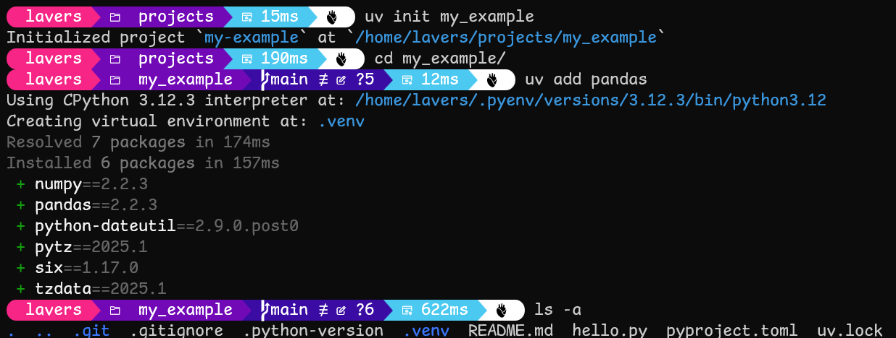

<h1>My Development Environment</h1>

Below is a description of the workspace setup and tools that I use on a daily basis and what a normal workflow looks like for me. Feel free to read through and cherry-pick the bits that suit you! 

Everything I list is free at the time of writing, although of course it assumes that you have already bought a reasonably powerful laptop.

> [!IMPORTANT]  
> **If you're looking to replicate my toolset, head down to the "Setup Instructions" section!**
>
> Each of the tools I list below lists some installation instructions on their website, but those are tailored towards installing that tool in isolation. They do this because it makes it easier for them to distribute their software.
> 
> This guide, on the other hand, is aimed at providing you with a complete working environment. That means that the best way to get set up is to make sure that all the tools are connected to one another. Ironically, this will make the installation process significantly simpler, since you can piggyback some programs off of each other!

<h2>Table of Contents</h2>

- [1 - Tools I Use](#1---tools-i-use)
  - [1.1 - WSL 2](#11---wsl-2)
    - [1.1.1 - Bash](#111---bash)
  - [1.2 - Windows Terminal](#12---windows-terminal)
  - [1.3 - Git](#13---git)
  - [1.4 - GitHub](#14---github)
  - [1.5 - VS Code (+ Key Extensions)](#15---vs-code--key-extensions)
    - [1.5.1 - Draw.io Integration Extension](#151---drawio-integration-extension)
    - [1.5.2 - Markdown All In One Extension](#152---markdown-all-in-one-extension)
    - [1.5.3 - Markdown Preview Github Styling Extension](#153---markdown-preview-github-styling-extension)
  - [1.6 - Python](#16---python)
    - [1.6.1 - UV](#161---uv)
    - [1.6.2 - IPyNB (aka Jupyter Notebooks) ](#162---ipynb-aka-jupyter-notebooks-)
  - [1.7 - Markdown](#17---markdown)
    - [1.7.1 - Mermaid](#171---mermaid)
  - [1.8 - DuckDB](#18---duckdb)
  - [1.9 - DBT](#19---dbt)
- [2 - Setup Instructions](#2---setup-instructions)
  - [2.1 - Get The Requirements Together](#21---get-the-requirements-together)
  - [2.2 - Activate WSL2](#22---activate-wsl2)
  - [2.3 - Set Up Your Ubuntu Installation](#23---set-up-your-ubuntu-installation)
  - [2.4 - Install Windows Terminal](#24---install-windows-terminal)
  - [2.5 - Set WSL2 Ubuntu as your default shell](#25---set-wsl2-ubuntu-as-your-default-shell)
  - [2.6 - Install Git (Twice)](#26---install-git-twice)
  - [2.7 - Configure Git](#27---configure-git)
  - [2.8 - Install VS Code](#28---install-vs-code)
  - [2.9 - Install VS Code Extensions](#29---install-vs-code-extensions)
  - [2.10 - Install UV](#210---install-uv)
  - [2.11 - Celebrate!](#211---celebrate)
- [3 - Example Workflows](#3---example-workflows)
  - [3.1 - I want to code a Python app](#31---i-want-to-code-a-python-app)
  - [3.2 - I want to analyse some data](#32---i-want-to-analyse-some-data)
  - [3.3 - I want to create a complex, repeatable pipeline](#33---i-want-to-create-a-complex-repeatable-pipeline)

---
---
---

## 1 - Tools I Use

The following are a collection of short descriptions of the technologies I have in my toolset that I use regularly. In practise, these are all entwined with one another in a dense thicket, but I've tried to draw each one out and highlight its usefulness. 

---
---

### 1.1 - [WSL 2](https://learn.microsoft.com/en-us/windows/wsl/about#what-is-wsl-2)

> WSL 2 (Windows Subsystem for Linux 2) is a feature in Windows that allows you to run a Linux environment directly on your Windows computer. It's like having a mini Linux computer inside your Windows PC, making it easier to use Linux tools and software without needing a separate machine.


This is such a godsend. 

Although Windows has the majority share on consumer desktop/laptop appliances, most of the actual infrastructure of the internet runs on Linux. This means that if you're writing code for the web (or working with code that other people on the web have created), working on a Linux machine makes things significantly smoother in a lot of ways.

Best of all, your machine remains a Windows machine, so you can jump back to your regular Windows installation whenever you want!

You also have access to all your regular Windows files from your Linux environment. So handy!!

---

#### 1.1.1 - [Bash](https://www.gnu.org/software/bash/)

> Bash (Bourne Again SHell) is a command-line interpreter that lets you interact with your computer by typing commands. It is available on Linux machines by default, which means that WSL gives it to you for free.
>
> Note that Bash is the *interpreter* - it takes commands that you type and executes them for you. The window that you type these commands into is a different program called a "terminal". See [Windows Terminal](#windows-terminal) below for my terminal program of choice.


> [!NOTE]  
> The above screenshot is from my own customised terminal. I've set up a font and colours that I like. The default interface looks a bit more stripped back, but it works exactly the same.

Although it might seem like this is a clunkier interface than the point-and-click graphical user interface (GUI) that most users are familiar with, a text-based interface is actually **much** more powerful. 

- Bash syntax is the "lingua franca" of coding - if you go looking for troubleshooting instructions online you will find that almost all of the solutions use Bash. Trying to apply this in a default Windows environment won't work, and will send you down a rabbithole of confusing hacks and alternatives. 
- For a practised user (which you will quickly become) keyboard input is much faster/more accurate than the mouse. 
- It is also much easier to precisely define behaviour in text format. Whether you are writing instructions for another person or writing a program for a computer, a few lines of Bash syntax can replace lengthy paragraphs of the form "click here, then open this menu, then select X... etc."

---
---

### 1.2 - [Windows Terminal](https://learn.microsoft.com/en-us/windows/terminal/)

> Windows Terminal is a modern, powerful tool for command-line users. It allows you to run multiple command-line applications, like Command Prompt, PowerShell, and Linux, all in one place.


This is the terminal window that you will run Bash in. Windows terminal lets you run any shell program that is installed on your machine, which means you can have the native Windows Powershell open right next to your Linux Bash shell (if you ever find a need to run Powershell again, that is!)

---
---

### 1.3 - [Git](https://git-scm.com/)

> Git is a popular version control system that helps you track changes in your code. It's like a time machine for your projects, allowing you to save different versions, collaborate with others, and revert to previous states if needed. Git is essential for teamwork in software development, as it makes it easy to manage and merge contributions from multiple developers. It's a powerful tool that ensures your codebase stays organized and history is preserved.


If you're writing something more complicated than "Hello World", you should be using Git. 

In particular, you should be using Git in the command line - through the Bash shell! I know it's confronting at first, but trust me - the buy-in of effort to learn Git in the CLI will seem like *extremely* small potatoes almost immediately after you pay it. Limping along with "Git Desktop" or whatever other GUI someone has skinned over the top is far more painful in the long run because it maintains a layer of abstraction between you and what is actually happening under the hood. Learn to use Git in the command line and you will become invincible.

---
---

### 1.4 - [GitHub](https://github.com/about)
> GitHub is a platform where developers can store, share, and collaborate on code projects. It uses Git to track changes and manage different versions of code, which means that you can use it back up all of your Git versioned software in the cloud.


Most likely you're reading this document on GitHub, so this one might seem a little redundant. It's important to call GitHub out, though, because it does a lot more than just render `readme.md` files! 

Github is the source of truth for all of your code. You should consider your local machine to be a temporary workspace and staging area where you create code - GitHub holds the "canonical" version of those files. If you drop your laptop in the bath, your code doesn't disappear.

Some other features of GitHub that you may find useful:
- **GitHub "Wikis"** let you create a wiki-style site that is linked to your code repo. This lets you document business practices/teamwork procedures related to your coding workflow without polluting the code files themselves.
- **GitHub "Actions"** let you automate processes. For example, with the right Actions setup you can make it so that every time you push an update to GitHub on the `main` Git branch, that update will automatically be sent out to the cloud hosting provider of your choice, updating your deployed product in real time. 
- **GitHub "Projects"** is a fully-featured project management suite. It lets you plan and organise your development work in the same place that your output is stored.
- **GitHub "Workspaces"** are cloud-hosted development environments that let you write and run code from anywhere. These are useful if you need to quickly make an update while you're away from your regular laptop, and can also be used for collaboration/teaching.
- **GitHub "Classroom"** is a complete education suite inside of GitHub. I can't believe this isn't more widely adopted. 

The best thing about all these tools is that they're fully integrated with each other! You can schedule a GitHub Action to create a task in a GitHub Project to remind you to mark a student's assignment whenever they make a submission in GitHub Classroom!

---
---

### 1.5 - [VS Code](https://code.visualstudio.com/) (+ Key Extensions)

> VS Code (Visual Studio Code) is a free, open-source code editor developed by Microsoft. It's designed to help you write and edit code efficiently with features like syntax highlighting, debugging, and extensions for various programming languages.


This is your workhorse. I write all of my code and almost all of my documents in VS Code. In addition to the basic code-editing functionality, it has a TON of useful extensions that you can install to help with various tasks. I've listed two Must Haves below, but you will no doubt find others that are handy too.

VS Code also has a built-in terminal where you can run shell commands, but I find this clunky to set up and a bit underwhelming. I use [Windows Terminal](#windows-terminal) to run my shell - a separate program that has a much nicer interface.

> [!CAUTION]  
> I've listed some extensions for VS Code that I use below. Please note that for many of these, you'll need to first install them in VS Code, and then select `Install in WSL` in order to get the functionality working.

---

#### 1.5.1 - [Draw.io Integration Extension](https://marketplace.visualstudio.com/items?itemName=hediet.vscode-drawio)

This extension is an incredible little tool that lets you create diagrams in the VS Code interface. You can choose to create them from code or through a GUI, and they are saved in your directory next to your other files. This means that you can embed a diagram in a document, have it all stored and version-controlled as code, and when you edit your diagram, the updated propagate to the document it is embedded in in real-time. 


Trust me, this is quicker than whatever you've been using for diagrams to date, because there's no swapping around waiting for some other editor to load, and no clicking around to insert files into documents. The diagrams it produces are clean and simple, and they Just Work.

---

#### 1.5.2 - [Markdown All In One Extension](https://marketplace.visualstudio.com/items?itemName=yzhang.markdown-all-in-one)

This adds a bunch of useful functionality for creating documents in [Markdown](#markdown). 

With this extension you can add tables of contents to your markdown files, etc, with a couple of keystrokes. Again, It Just Works.

---

#### 1.5.3 - [Markdown Preview Github Styling Extension](https://marketplace.visualstudio.com/items?itemName=bierner.github-markdown-preview)

This makes sure that the preview of your markdown code that you see in VS Code looks identical to what readers will see when they access the document on GitHub. This is important because there are a couple of very useful features that are unique to GitHub-flavoured Markdown, including "alerts", and Mermaid diagram rendering.

> [!NOTE]  
> This note is an example of a GitHub-flavoured Markdown "alert"!

---

There are a few other must-have extensions, but they work a little more behind-the-scenes, so I haven't described them here. Look for them in the "Setup Instructions" section.

---
---

### 1.6 - [Python](https://www.python.org/)

> Python is a versatile and beginner-friendly programming language. It's known for its simple and readable syntax, which makes it easy to learn and use. Python is widely used in various fields, including web development, data analysis, artificial intelligence, and scientific computing. Its extensive libraries and frameworks allow you to accomplish a lot with minimal code.


There's a reason Python is used in so many fields. Sure, it doesn't offer the surgical control over low-level memory operations that languages like C and Rust have, but who cares? Python is for getting stuff done, fast, and no other language comes close to it for that.

It also has the best data analysis tools by a wide margin. The only other language you should bother messing with for data is SQL. And with tools like [DuckDB](#duckdb), you can write your SQL in Python!

---

####  1.6.1 - [UV](https://astral.sh/blog/uv)
> Astral.uv is a tool that helps you manage Python projects and their dependencies much faster than traditional tools. It combines many functions like installing packages, managing Python versions, and running scripts into one easy-to-use package. Think of it as a super-efficient assistant for all your Python project needs.



Up until recently, the one big complaint around Python as a language was that it didn't have a good toolset for project/dependency management. Great news - those days are over!

UV is incredible:
- It's SO quick
- It always gets it right
- It makes it so that setting up your projects in a comprehensive, rigorous way is **simpler** than taking a quick-and-dirty path. 

My only note around UV is that it is funded by venture-capital groups. This makes some people think that in the future it might become a paid service. I'm not too concerned about this - if that happens we will either:
1. Keep using the old, free version of it, or
2. Find something new that works just as well

---

#### 1.6.2 - [IPyNB (aka Jupyter Notebooks) ](https://code.visualstudio.com/docs/datascience/jupyter-notebooks)

>  `.ipynb` is a file format that lets you write Python code in interactive documents instead of a script (`.py` format). This means you can write and run code directly in the file, allowing you to get immediate feedback on the results. They are great for learning and sharing code. 


This is a standard tool of data analysis. If you've every used Jupyter Notebook, you've used this file format. The only difference here is that you'd be working in VS Code instead of the Jupyter interface. That's good because it gives you more control over your work environment - you'll be managing the environment yourself instead of having Jupyter/Anaconda do it for you.

One really helpful thing about the `.ipynb` format is that you can insert text and diagrams into the document around your code and results. This means that you can perform your analysis in the same documentation you present your results in!

---
---

### 1.7 - [Markdown](https://commonmark.org/help/)

> Markdown is a simple way to format text using plain text symbols, making it easy to create headings, lists, links, and more. It's widely used for writing documentation, notes, and even web content because it's easy to read and write. Think of it as a lightweight alternative to HTML for formatting text!


Markdown is the best way to write documents. I will accept no imitators. 

The image above is the same one that I used to showcase VS Code earlier in this document. Take a close look at it. Inside of VS Code I have three panels. The leftmost one is the file pane that lists the files available in my workspace. The middle one is that Markdown code that defines this very document. The rightmost one is a preview of the page that you're reading right now. 

Markdown lets me create complex, beautiful documents incredibly quickly. 

It may seem that Microsoft Word et al are simpler to use, but don't be fooled. Microsoft Word's interface is extremely complex, and it hides the actual code inside your files, only showing you the document that is presented to the reader. Markdown, on the other hand, puts the code directly in your hands, and makes that code so simple that it barely looks different to the plaintext you're typing.

On top of this, you get the **massive** benefit of being able to version control your files just as if they were code, write them in the same editor as your code, and share them in fully-rendered glory on GitHub. (Example: this document!)

---

#### 1.7.1 - [Mermaid](https://mermaid.js.org/)
> Mermaid is a tool that lets you create diagrams and flowcharts using a simple text-based syntax. It's great for visualizing complex information quickly and easily, without needing to use a separate drawing tool. 


Mermaid is technically a separate tool to Markdown. They both operate on the principle that the best way to create media is to use a simple code file to define what you want your reader to see. Where they differ is that Markdown is intended to create written documents, while Mermaid is intended to create diagrams. 

The good news is that GitHub-flavoured Markdown lets you embed Mermaid diagram code directly into your Markdown code! This means that if you use the [Markdown Preview Github Styling Extension](#markdown-preview-github-styling-extension) in VS Code, you'll be able to see the diagrams update in real time as you write them, and when you push your documents to [GitHub](#github) your readers will see the diagrams rendered there.

> [!NOTE]  
> I know - we already have a diagramming tool in the [1.5.1 - Draw.io Integration Extension](#151---drawio-integration-extension) for VS Code. So why do we need another one?
>
> The answer is just that they're useful in different contexts. 
> 
> When I need to quickly click and drag a sketch together in order to document some idea during a meeting, `draw.io` lets me do that in a way that my audience can understand. Then I can insert that diagram into my notes to record what was said.
>
> On the other hand, if I want to produce a piece of software documentation, it's better to use Mermaid because it means that any future updates to the diagram can be summed up in a few simple lines of code by leveraging a diff against the markdown file. If I used `draw.io`, the changes would be much pretty much illegible.

---
---

### 1.8 - [DuckDB](https://duckdb.org/)
> DuckDB is an in-process SQL database management system designed for fast analytical queries. It's lightweight and can be embedded directly into your applications, making it easy to use without needing a separate server.


All of the tools in this document are extremely useful, but DuckDB is a strong contender for the tool that brings me the most joy to use. I used to run a local Postgres database on my laptop so that I would have something to leverage SQL queries against/run DBT pipelines in. That was a bit of a headache. Now I just use DuckDB, and it is incredibly convenient. 

The screenshot above shows me creating an "in-memory" DuckDB table from dummy data in the CLI. DuckDB lets you create a standalone database file if you want to persist your tables, but it also lets you skip that requirement like I'm doing here - the only place this table is stored is in my machine's RAM. Next, I export that table to a `.csv` file. Finally, I *leverage an SQL query against that `.csv` as though it was a table!*

This rules. So much busywork gets completely removed by just being able to treat `.csv` files as though they are database tables. Even better, you don't need to work within the CLI - the DuckDB library for Python will let you write the following code without any qualms at all:

```py
# my_file.ipynb cell #1

import duckdb

# Execute SQL commands
df = duckdb.sql("""
    SELECT * FROM read_csv('dummy_data.csv');
""")

df.show()
```

> Output:
> ```
> ┌───────┬─────────┬───────┐ 
> │  id   │  name   │  age  │    
> │ int64 │ varchar │ int64 │  
> ├───────┼─────────┼───────┤  
> │     1 │ Alice   │    30 │  
> │     2 │ Bob     │    25 │  
> │     3 │ Charlie │    35 │  
> └───────┴─────────┴───────┘  
> ```

```py
# my_file.ipynb cell #2

duckdb.sql("""
    SELECT id FROM df where age=25;
""")
```

> Output:
> ```
> ┌───────┐
> │  id   │
> │ int64 │
> ├───────┤
> │     2 │
> └───────┘
> ```

Yes, you read that right - you can run SQL queries **_against python variables_**. 🤯🤯🤯

---
---

### 1.9 - [DBT](https://www.getdbt.com/)
> Data Build Tool (dbt) works by parsing your project's SQL queries and compiling them into executable SQL code for your data warehouse. It then runs these scripts in the correct order based on model dependencies, transforming raw data into the desired format. Finally, dbt allows you to define and run tests on your models to ensure data accuracy and integrity.


This last one is a bit more of a heavyweight tool. 

Most of the time when I need to do local data analysis, a single `.ipynb` file will do. When I need to do something more complex, and I need my results to be rigorous, testable, and version-controlled, I turn to DBT.

This tool lets you define steps in your pipeline as SQL queries (or Python code if you prefer). It has a whole templating language that lets you organise your queries to be modular and concern-separated. Then it runs your pipeline for you by leveraging each query in order against your database. It will handle complex dependency graphs for you to make sure the queries run in the correct order. It even lets you define tests and contracts to ensure that the results you're getting out of the pipeline are correct! AND it has an excellent documentation suite built into it.

---
---
---
 

## 2 - Setup Instructions
This section is aimed at getting you set up with the whole environment listed above in as few steps as possible. 

---
---

### 2.1 - Get The Requirements Together

Don't start until you have everything you need.

| Requirement                                                                                                 | Notes                                                                                                                                                                                                                                                                                                                                                                                                                                                                                                                                                                                                                                                                                 |
| ----------------------------------------------------------------------------------------------------------- | --------------------------------------------------------------------------------------------------------------------------------------------------------------------------------------------------------------------------------------------------------------------------------------------------------------------------------------------------------------------------------------------------------------------------------------------------------------------------------------------------------------------------------------------------------------------------------------------------------------------------------------------------------------------------------------- |
| A desktop or laptop that has at least 16GB of RAM, running Windows 11 OS with all of the updates installed. | *These instructions are aimed at setting up a *Windows* machine. If you have a Mac, your setup process will be different. If you are running a Linux OS, they'll be different again.  Once you've got your machine set up, you'll find that you can use a similar workflow no matter what operating system you're using, but there are enough Windows-specific instructions below that you should not try to apply these instructions on any operating system except Windows.* <br><br>*You can probably get by with 8GB if you're on a tight budget, but you may run into performance problems. If you can get 32GB, use that, but don't break the bank on it if you can't afford it.* |
| Admin access to your machine.                                                                               | *To install software and update settings, you need to be an administrator. If you're using a work laptop, you might not have it. <br><br>To check, you can try clicking the Windows Menu button in the taskbar, right-clicking on any installed program, and selecting "Run As Administrator". If you can get the program to run like this, you're set.*                                                                                                                                                                                                                                                                                                                                |
| A fast internet connection.                                                                                 | *You'll be downloading software in the following steps - you don't want to be hotspotting on your mobile phone.*                                                                                                                                                                                                                                                                                                                                                                                                                                                                                                                                                                        |
| Time.                                                                                                       | *This isn't such a big undertaking, but it's better not to be rushed. It would be annoying to get halfway through and get cut off. Make sure you're not going to run out of batteries on your laptop or be kicked out of a cafe before you can finish.*                                                                                                                                                                                                                                                                                                                                                                                                                                 |

---

### 2.2 - Activate WSL2

1. In the search field in your taskbar, type `PowerShell`.
2. Right click on `Windows PowerShell` and select `Run as administrator`.
3. In the PowerShell window, run the following command:
    
    ```
    wsl --install
    ```

---

### 2.3 - Set Up Your Ubuntu Installation

1. In the search field in your taskbar, type `Ubuntu`
2. When prompted, select a **User Name** and **Password** (This User Name and Password is specific to each separate Linux distribution that you install and has no bearing on your Windows user name.)
> [!CAUTION]  
> Please note that whilst entering the Password, nothing will appear on screen. This is called blind typing. You won't see what you are typing, this is completely normal. Type carefully!
3. Downloand and install updates by running the following command:
   ```
   sudo apt update && sudo apt upgrade
   ```
   (You may be prompted to enter your newly-set password.)

---

### 2.4 - Install Windows Terminal

1. Open the Microsoft Store.
2. Search for `Windows Terminal`.
3. Click `Get` to install it.

I recommend pinning Windows Terminal to your taskbar.

---

### 2.5 - Set WSL2 Ubuntu as your default shell

This should make is to that whenever you open Windows Terminal, Ubuntu's "Bash" shell is selected by default.

1. Open Windows Terminal:
2. Open Settings by clicking the drop-down arrow next to the plus (`+`) tab in the Windows Terminal, and selecting `Settings`.
3. In the Settings tab, look for the list of profiles on the left side. Click on "Ubuntu" (or the name of your installed WSL distribution).
4. Scroll down to the "GUID" field and copy the GUID value (it looks like a long string of characters inside curly braces, e.g., `{12345678-1234-1234-1234-1234567890ab}`).
5. Go back to the main Settings page and scroll down to the "Startup" section. In the "Default profile" drop-down menu, select the GUID you copied earlier.
6. Click "Save" to apply the changes.
7. Close and re-open Windows Terminal to check that it worked.

---

### 2.6 - Install Git (Twice)

1. Install in WSL:
  In the Bash shell in Windows Terminal, run the following command:
   ```
   sudo apt update && sudo apt install git
   ```
   (You may be prompted to enter your newly-set password.)
2. [Install Git for Windows too.](https://git-scm.com/downloads/win)

> [!NOTE]  
> Yes, we are installing Git twice here. It's silly, but we need both installations. The installation on the base Windows OS gives us access to the Git Credential Manager, which is so useful that it's practically necessary. The installation on WSL gives us the version we actually use.

---

### 2.7 - Configure Git

1. Set default main branch name:
  ```bash
  git config --global init.defaultBranch main
  ```
2. Set your username:
  ```bash
  git config --global user.name "YOUR NAME HERE"
  ```
3. Set your email:
  ```bash
  git config --global user.email "YOUR@EMAIL.HERE"
  ```
4. Set the Windows Git Credential Manager as your chosen credential manager. 
  > [!TIP]  
  > You might have to do some work here to find where GCM lives on your machine. For me it is at `C:\Users\Lavers\AppData\Local\Programs\Git\mingw64\bin\git-credential-manager.exe`.  
  > 
  > You then need to convert that path to unix format from the perspective of your WSL installation. My example becomes: `/mnt/c/Users/lavers/AppData/Local/Programs/Git/mingw64/bin/git-credential-manager.exe`
  >
  > If in doubt, use the Bash shell to root around in your `/mnt/c/Users/` directory using the `cd` and `ls` commands to try and find what you need!

  ```bash
  git config --global credential.helper "PATH\TO\GCM\HERE"
  ```
---

### 2.8 - Install VS Code

1. Head to https://code.visualstudio.com/ and click `Download for Windows`
2. Find the downloaded `.exe` file, right click it, and select `Run as administrator`

> [!IMPORTANT]  
> When prompted to `Select Additional Tasks` during installation, be sure to check the `Add to PATH` option so you can easily open a folder in WSL using the `code` command.

---

### 2.9 - Install VS Code Extensions

1. Open VS Code
2. Click the "Extensions" interface in the panel on the left
3. Search for the following extensions one-by-one and install them:
   - `Python` (Microsoft)
   - `Remote Development` (Microsoft)
   - `WSL` (Microsoft)
   - `Jupyter` (Microsoft)
   - `Draw.io Integration` (Henning Dieterichs)
   - `Markdown All in One` (Yo Zhang)
   - `Markdown Preview Github Styling` (Matt Bierner)
   - `Markdown Table` (Takumi Ishii)

There are some others you might also enjoy, but they're not stricly necessary. I recommend checking out `Live Server` for writing HTML, `Pylance` for code interpretation, and `Git Graph` for viewing your Git history. 

---

### 2.10 - Install UV

1. In the Bash shell in Windows Terminal, run the following command:
    ```
    curl -sSL https://install.uv.tools | bash
    ```

---

### 2.11 - Celebrate!
That's it, we're set up! How easy was that??

---
---

## 3 - Example Workflows

> [!WARNING]  
> The below sections are a list of alternatives! 
> 
> **Don't apply every section below every time you start work.** Instead, pick the description that suits your needs best, and just follow those steps. 

---
---

### 3.1 - I want to code a Python app
This is the simplest workflow, although for most apps it will of course get a bit more complicated as more dependencies and tools are introduced.

1. Open Shell  
    > Open Ubuntu's Bash shell in Windows Terminal
2. Navigate To Projects Folder  
    > Navigate to the folder where you keep your coding projects. Example command: 
    ```bash
    cd ~/projects
    ```
3. Initialise A New Project With UV
    ```bash
    uv init my_project 
    ```
4. Change Directory Into Your New Project
    ```bash
    cd my_project
    ```
5. Add A `.venv`  
    > This virtual environment will allow you to install dependencies locally without having them spill out through your whole computer.
    ```bash
    uv venv .venv
    ```
6. Add Dependencies As Required  
    > You can add anything from the Pypi register of course! Here I'm adding the `cowsay` package as an example.
    ```bash
    uv add cowsay
    ```
7. Activate Your `.venv`
    ```bash
    source .venv/bin/activate
    ```
    > You'll have to do this each time you want to run your app!
8. Open VS Code
    ```bash
    code .
    ```
9. Get Coding!
    > Well, off you go.

---
---


### 3.2 - I want to analyse some data
For this, we'll use DuckDB and Jupyter Notebooks.

1. Open Shell
    > Open Ubuntu's Bash shell in Windows Terminal
2. Navigate To Projects Folder
    > Navigate to the folder where you keep your coding projects. Example command: 
    ```bash
    cd ~/projects
    ```
3. Initialise A New Project With UV
    ```bash
    uv init my_project 
    ```
4. Change Directory Into Your New Project
    ```bash
    cd my_project
    ```
5. Add A `.venv`
    > This virtual environment will allow you to install dependencies locally without having them spill out through your whole computer.

    ```bash
    uv venv .venv
    ```
6. Add Dependencies As Required
    > The dependencies matter here. You'll probably need to include some of your own (Numpy? Pandas? Etc?), but add a minimum you want the following:

    ```bash
    uv add duckdb ipykernel
    ```
7. Create A Folder For Data
    > You want somewhere to put your source and output files that won't get committed to GitHub!!

    ```bash
    mkdir data
    ```
8. Open Project Directory in VS Code

    ```bash
    code .
    ```
9. Amend `.gitignore`
    > We need to add some stuff to our `.gitignore` file

    ```diff
    # .gitignore

    # Python-generated files
    __pycache__/
    *.py[oc]
    build/
    dist/
    wheels/
    *.egg-info

    + # Our stuff
    + .venv/
    + dbt_packages/
    + dbt_modules/
    + logs/
    + *.duckdb
    + .ipynb_checkpoints/
    + *.duckdb.wal
    + data/
    ```
10. Create An `.ipynb` File And Get Coding!
    The `.ipynb` format is the Jupyter Notebook file format. It's super handy. Don't forget - data files go in your `data/` directory. [There's some example code here](./examples/duckdb_example/).

---
---

### 3.3 - I want to create a complex, repeatable pipeline
This one is for when you want to make something that keeps working into the future and can be easily refactored when you need to upgrade it.
1. Open Shell
    > Open Ubuntu's Bash shell in Windows Terminal
2. Navigate To Projects Folder
    > Navigate to the folder where you keep your coding projects. Example command: 
    ```bash
    cd ~/projects
    ```
3. Initialise A New Project With UV
  ```bash
  uv init my_project 
  ```
4. Change Directory Into Your New Project
  ```bash
  cd my_project
  ```
5. Add A `.venv`
    > This virtual environment will allow you to install dependencies locally without having them spill out through your whole computer.

    ```bash
    uv venv .venv
    ```
6. Modify the Activate Script

    ```bash
    echo 'export DBT_PROFILES_DIR="$VIRTUAL_ENV/.dbt"' >> .venv/bin/activate
    ```

    > This ensures DBT uses the local profile when the venv is active.
7. Create Project Structure

    ```bash
    mkdir -p {models,notebooks,.dbt}
    ```
8. Install Dependencies

    ```bash
    uv add dbt-duckdb ipykernel ipython
    ```
9. Activate the environment:
    ```bash
    source .venv/bin/activate
    ```
10. Open Repo in VS Code
    ```bash
    code .
    ```
11. Amend `.gitignore`
    > We need to add some stuff to our `.gitignore` file

    ```diff
    # .gitignore

    # Python-generated files
    __pycache__/
    *.py[oc]
    build/
    dist/
    wheels/
    *.egg-info

    + # Our stuff
    + .venv/
    + dbt_packages/
    + dbt_modules/
    + logs/
    + *.duckdb
    + .ipynb_checkpoints/
    + *.duckdb.wal
    + data/
    ```
12. Create `.dbt/profiles.yml` file

    > Use the VS Code file tree interface to create the following file in the `.dbt` directory called `profiles.yml`:

    ```yaml
    my_duckdb_project:
      target: dev
      outputs:
        dev:
          type: duckdb
          path: my_database.duckdb
    ```
13. Create `dbt_project.yml`

    > Create this file in the root project directory.  
    > **Don't create it in the `.dbt` directory! It needs to go next to your `.gitignore` file!**

    ```yaml
    name: my_duckdb_project
    version: '1.0'
    config-version: 2

    profile: my_duckdb_project

    model-paths: ["models"]
    ```
14. Create A Notebook To Run DBT
    > You can use a bash script instead if you want. 
    > Create `notebooks/run_dbt_pipeline.ipynb` with the following content:

    ```python
    from dbt.cli.main import dbtRunner

    runner = dbtRunner()
    result = runner.invoke(["run", "--project-dir", ".", "--profiles-dir", ".dbt"])

    for r in result.result:
        print(f"{r.node.name}: {r.status}")
    ```
15. Write Your Models!

    > This is most of the work. Each model is a SQL query in its own `.sql` file, that defines a new table in your database. See the example repo for a glance at what this might look like.
16. Run That Notebook!

    > That's it, you're done!